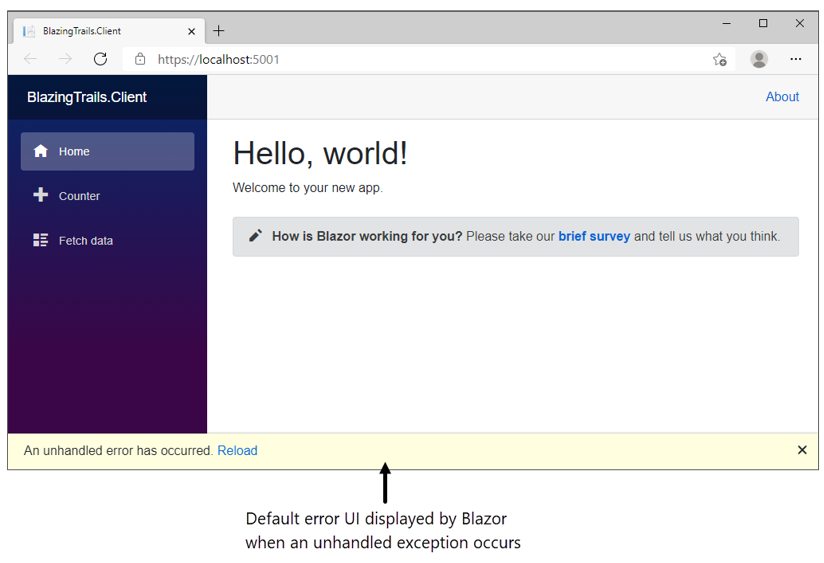
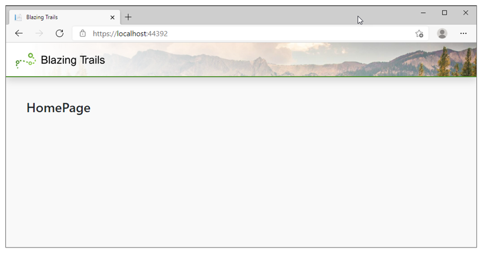

# 建立新的项目

创建的是 Blazor WebAssembly 项目，有 `wwwroot` 文件夹

## 需求

建立一个展示所有路线的网站。

<!-- TODO -->

# Blazor WebAssembly 加载顺序

1. `index.html`
2. `blazor.webassembly.js`
3. .NET WebAssembly 运行时 和 依赖
4. 将界面加载到 `div#app`

# 重要的文件

- `index.html`
- `Program.cs`

## index.html

只有WebAssembly 才有 `index.html`

```html
<!DOCTYPE html>
<html lang="en">

<head>
    <meta charset="utf-8" />
    <meta name="viewport" content="width=device-width, initial-scale=1.0, maximum-scale=1.0, user-scalable=no" />
    <title>BlazingTrails.Client</title>
    <base href="/" />
    <!-- blazor 使用 这个base标签 来处理路由 -->
    <link href="css/bootstrap/bootstrap.min.css" rel="stylesheet" />
    <link href="css/app.css" rel="stylesheet" />
    <link href="BlazingTrails.Client.styles.css" rel="stylesheet" />
</head>

<body>
    <div id="app">Loading...</div>
    <!-- 使用这个标签来展示Blazor应用 -->

    <div id="blazor-error-ui">
        <!-- 当错误出现时，展示这个界面 -->
        An unhandled error has occurred.
        <a href="" class="reload">Reload</a>
        <a class="dismiss">🗙</a>
    </div>
    <script src="_framework/blazor.webassembly.js"></script>
    <!-- 下载运行时、依赖项，初始化程序 -->
</body>

</html>
```

这个就是出现异常后，blazor-error-ui展示的画面



## Program.cs

```cs
using BlazingTrails.Client;
using Microsoft.AspNetCore.Components.Web;
using Microsoft.AspNetCore.Components.WebAssembly.Hosting;

var builder = WebAssemblyHostBuilder.CreateDefault(args); // 构建一个WebAssemblyHostBuilder实例
builder.RootComponents.Add<App>("#app");
builder.RootComponents.Add<HeadOutlet>("head::after"); // 为程序设置根组件

builder.Services.AddScoped(sp => new HttpClient { BaseAddress = new Uri(builder.HostEnvironment.BaseAddress) }); // 注册服务

await builder.Build().RunAsync(); // 利用已有设置，创建WebAssemblyHost实例
```

C#9 新特性：**top-level statements** Main方法不在需要包括在 命名空间和类内。详细内容看[官方文档](https://docs.microsoft.com/dotnet/csharp/whats-new/tutorials/top-level-statements)

### 关键部分

1. 根组件 root components
2. 添加到 `IServiceCollection` 的服务 services

#### Root Components

默认情况下注册两个根组件：`App`和`HeadOutlet`。

- `App` 作为程序入口
- `HeadOutlet` 是.NET 6 新加入的，可以修改`<head>`标签内的元素，更新`<meta>`标签

这个是通过CSS选择器进行选择的

#### Services 

使用依赖注入(Dependency Injection)进行服务管理，一共有三种类型：

1. Transient：**一次请求，可以有多个实例**。每次从服务容器中请求时都会提供一个新的实例。在一个请求中，如果两个对象需要一个瞬时服务的实例，它们将各自收到一个不同的实例。
2. Scoped：**一次请求，一个实例**。每个请求都会创建一个新的实例。在一个请求中，你将始终在整个应用中获得相同的服务实例。
3. Singleton：**一个程序，一个实例**。当第一次从服务容器中请求时，或者当运行Program.Main方法时，就会创建一个实例，并在注册时指定一个实例。在应用程序的生命周期中，同一个实例被用来满足每个请求。

对于WebAssembly来讲，Scoped和Singleton是一样的，因为在Blazor WebAssembly内是不会进行request请求的。

### WebAssemblyHost

Main 函数最后做的一件事就是，将指定`WebAssemblyHostBuilder`所有的配置，并调用其`Build`方法。这将创建一个`WebAssemblyHost`的实例，这是Blazor应用程序的核心(它包含运行你的应用程序所需的所有应用程序配置和服务)。

## App.razor

Blazor 程序的根组件，使用`RootComponents.Add<App>("<CSS选择器>");`，可以有多个根组件。

在程序第一次启动后，会扫描所有可以路由的组件（routable components)，并保存对应的信息。路由改变后会自动匹配，匹配到就加载对应组件，不然就加载 “未找到组件”

## wwwroot 文件夹 和 _Imports.razor

作为ASP.NET的惯例，`wwwroot`是存放静态文件(JS, CSS, 图像等)的位置，所有你放到其中的文件都可以在发布后访问。

`_Imports.razor` 可选，保存常用的`using`语句，减少代码量(其他**同文件夹下的**组件里面就不用再写了)。

# 编写第一个组件

## 文件结构

默认是按照职责划分：`Pages`放可路由的组件，`Shared`放多处使用的文件。

- 缺点：不方便扩展，因为文件分散在各个文件夹中，添加和改变功能变得较为困难。
- 改进：使用`feature folders`：按功能来划分

原本的结构：

```
Pages
    Account.razor
    ProductList.razor
    Product.razor
    ShoppingBasket.razor
Components
    AccountDetails.razor
    AccountSummary.razor
    AddressList.razor
    ItemSummary.razor
    ProductDetail.razor
    ProductStockAndPrice.razor
    ShoppingBasketItemSummary.razor
    ShoppingBasketPaymentOptions.razor
    ShoppingBasketDeliveryOptions.razor
Shared
    Button.razor
    Table.razor
```

按功能来

```
Account
    AccountPage.razor
    Summary.razor
    Details.razor
    AddressList.razor
ProductList
    ProductListPage.razor
    ItemSummary.razor
Product
    ProductPage.razor
    Details.razor
    StockAndPrice.razor
ShoppingBasket
    ShoppingBasketPage.razor
    ItemSummary.razor
    PaymentOptions.razor
    DeliveryOptions.razor
Shared
    Button.razor
    Table.razor
```

但是静态资源还是要放在`wwwroot`文件夹内，不然在运行时就无法访问，但在`wwwroot`文件夹内也可以建立相似的结构

惯例：将可路由组件的名字后加`Page`

# 开始构建

## 设定布局 Layout

所有Blazor布局都要继承`LayoutComponentBase`

一个应用可以使用多个布局，要在`App.razor`里的`Router`设置。

```razor
<Router AppAssembly="@typeof(App).Assembly">
    <Found Context="routeData">
        <RouteView RouteData="@routeData" DefaultLayout="@typeof(MainLayout)" />
        <FocusOnNavigate RouteData="@routeData" Selector="h1" />
    </Found>
    <NotFound>
        <PageTitle>Not found</PageTitle>
        <LayoutView Layout="@typeof(MainLayout)">
            <p role="alert">Sorry, there's nothing at this address.</p>
        </LayoutView>
    </NotFound>
</Router>
```

### 创建布局 Layout

新建`Features/Layout/MainLayout.razor`

1. 继承`LayoutComponentBase`
2. 使用`@Body`参数指定页面位置

```razor
@inherits LayoutComponentBase

<main class="container mt-5 mb-5">
	@Body
</main>
```

新建`Features/Layout/Header.razor`组件，定义头部

```razor
<nav class="navbar mb-5 shadow">
    <a class="navbar-brand" href="/">
        
    </a>
</nav>
```

然后将组件添加到`MainLayout`中

## HomePage

`Features/Home/Homepage.razor`

通过添加`@page "/"`使其变为可路由组件

现在运行程序就可以正常看到主页面了：



### 添加业务逻辑

创建`Features/Home/Trails.cs`

```cs
public class Trail
{
    public int Id { get; set; }
    public string Name { get; set; } = string.Empty;
    public string Description { get; set; } = string.Empty;
    public string Image { get; set; } = string.Empty;
    public string Location { get; set; } = string.Empty;
    public int TimeInMinutes { get; set; }
    public string TimeFormatted => $"{TimeInMinutes / 60}h {TimeInMinutes % 60}m";
    public int Length { get; set; }
    public IEnumerable<RouteInstruction> Route { get; set; } = Array.Empty<RouteInstruction>();
}
public class RouteInstruction
{
    public int Stage { get; set; }
    public string Description { get; set; } = string.Empty;
}
```

目前还没有后端，所以用创建一个JSON，模拟请求结果。所有数据放到了`wwwroot/trails/`下

使用`HttpClient`获取数据。

在Blazor中使用依赖注入较为方便，使用方法：`@inject [TYPE] [NAME]`

在目前的情况下，使用`@inject HttpClient Http`进行依赖注入

相当于一下的C#代码(在`@code`中)

```cs
[Inject]
public HttpClient Http { get; set; }
```

修改后的`Features/Home/Homepage.razor`

```razor
@page "/"
@inject HttpClient Http
<h3>HomePage</h3>
@code {
    private IEnumerable<Trail> _trails;
}
```

### OnInitialized

所有Blazor组件都继承于`ComponentBase`，默认有`OnInitialized`, `OnParametersSet`, `OnAfterRender`，它们均有异步方法

`System.Text.Json`提供了`HttpClient`的扩展方法：

- `GetFromJsonAsync<T>`
- `PostAsJsonAsync`
- `PutAsJsonAsync`

当返回失败代码后，会抛出`HttpRequestException`，注意用try catch封装

详细的生命周期请看[章节3]()

### 增加内容

将每个路线已卡片的形式表现出来，所以把路线卡片(Trail Card) 单独提出来，作为一个组件

`Features/Home/TrailCard.razor`

```razor
<div class="card shadow" style="width: 18rem;">
    
    <div class="card-body">
        <h5 class="card-title">@Trail.Name</h5>
        <h6 class="card-subtitle mb-3 text-muted">
            <span class="oi oi-map-marker"></span>
            @Trail.Location
        </h6>
        <div class="d-flex justify-content-between">
            <span>
                <span class="oi oi-clock mr-2"></span>
                @Trail.TimeFormatted
            </span>
            <span>
                <span class="oi oi-infinity mr-2"></span>
                @Trail.Length km
            </span>
        </div>
    </div>
</div>
@code {
    [Parameter, EditorRequired] // EditorRequired 告诉编译器这个参数是必传的
    public Trail Trail { get; set; } = default!; // 这里使用的是!操作符，告诉编译器这个值不可能为空，如果运行时传null，会立马报错
}
```

`Features/Home/Homepage.razor`

```razor
@page "/"
@inject HttpClient Http

<PageTitle>Blazing Trails</PageTitle>
@if (_trails == null)
{
    <p>Loading trails...</p>
}
else
{
    <div class="grid">
        @foreach (var trail in _trails)
        {
            <TrailCard Trail="trail" /> 
            <!-- 这里传入了trail -->
        }
    </div>
}


@code {
    private IEnumerable<Trail>? _trails;
    protected override async Task OnInitializedAsync()
    {
        try
        {
            _trails = await Http.GetFromJsonAsync<IEnumerable<Trail>>("trails/trail-data.json");
        }
        catch (HttpRequestException ex)
        {
            Console.WriteLine($"There was a problem loading trail data: {ex.Message}");
        }
    }
}
```

# 总结

- 本项目使用的是WebAssembly，通过index.html 加载blazor.xxx.js加载环境和写好的代码。
- WebAssembly 没有Startup类，只能在Program类中设置和注册服务
- 先构造`WebAssemblyHostBuilder`，设置根组件和服务，然后使用`Program.cs`创建和运行`WebAssemblyHost`实例
- 使用特性文件夹(Feature Folder)进行文件组织，按不同的功能进行划分
- 通过 Layout 组件定义常用UI(每个页面都会用到的：导航+头部)
- `App.razor`是默认根组件，其它组件在其下渲染
- 可以在组件中通过参数传递信息，必须是公开属性