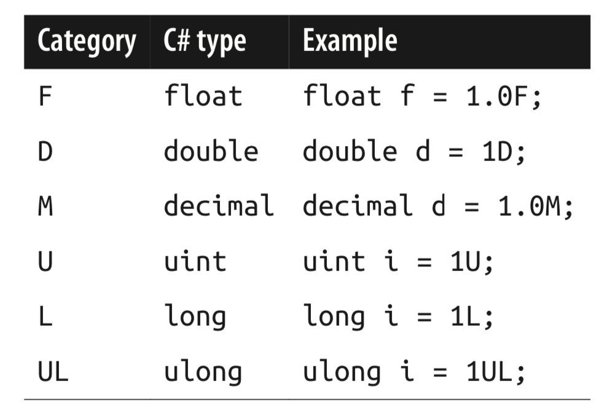

# 数值类型

## 预定义的数值类型


### 各种表示方法

不区分大小写

- 整数型
  - 10进制
  - 16进制：前边加上0x前缀
- 可以使用下划线`_` C# 7.0，为了增强可读性，无实义
  - 2进制：0b
- 实数型
  - 使用小数点：1.3234
  - 指数形式：1E06

### 类型推断

默认情况下，编译器会推断一个数值Literal是double还是整数类型：

- 如果包含小数点，或以指数形式展现，那么就是`double`类型
- 否则literal的类型是下面列表里第一个能容纳该数值的类型：`int`，`uint`，`long`，`ulong`

```c#
Console.WriteLine(1.0.GetType());           // System.Double
Console.WriteLine(1e06.GetType());          // System.Double
Console.WriteLine(1.GetType());             // System.Int32
Console.WriteLine(0xf000_0000.GetType());   // System.UInt32
Console.WriteLine(0x1_0000_0000.GetType()); // System.Int64
Console.WriteLine(0b1100_0010.GetType());   // System.Int32
```

### 数值的后缀



- U、L很少使用，因为uint、long、ulong要么可以被推断出来，要么可以从int隐式转换过来
- D 其实很多余。
- F、M是比较有用的，当指定float或decimal的Literal的时候，应该加上。

## 类型转换

- 当目标类型可以容纳源类型的时候，整数转换是隐式的。
- 否则，就需要显式转换。

```c#
int x = 12345;
long y = x;         // 隐式转换 int类型的范围小于long类型的范围
short z = (short)y; // 显式转换
```

### 类型转换 浮点型

- float 范围小于 double
- float 可以隐式的转换为 double
- double 必须显式的才能转换为 float

### 浮点型和整数类型转换

- 所有的整数类型都可以隐式的转换为所有的浮点类型
- 反过来则必须进行显式转换

**注意**：

- 当从浮点型转为整型时，小数部分是被截断的，没有舍入。
- 把一个很大的整数隐式的转换为浮点类型之后，会保证量级不变，但是偶尔会丢失精度。这是因为浮点类型有更多的量级，而精度可能不足。

### decimal 转换

- 所有的整数类型可以被隐式的转换为decimal类型
- 反过来则必须进行显式转换

## 操作符

### + - * / %

除法注意：

- 针对整型的除法操作，会截断余数
- 除数变量为0，会抛出`DivideByZeroException`，运行时异常。
- 除数Literal为0，编译错误。

### 8,16位整数类型 运算问题

`byte`、`sbyte`、`short`、`ushort`

没有自己的算术操作符，C#会按需对它们进行隐式转换到大一点的整数类型。

```c#
short x = 1;
short y = 1;
// short z = x + y;  // 报错
short z = (short) x + y;
```

### 自增/自减 ++ --

- 变量2 = ++变量1：先加再赋值
- 变量2 = 变量1++：先赋值再加

### 按位操作符


### float 和 double的特殊值


- `NaN` (not a number)、`+∞`、`-∞`、`-0`
- `MaxValue`，`MinValue`，`Epsilon`

```c#
Console.WriteLine(1.0 / 0.0);   // ∞
Console.WriteLine(-1.0 / 0.0);  // -∞
Console.WriteLine(1.0 / -0.0);  // -∞
Console.WriteLine(-1.0 / 0.0);  // -∞

Console.WriteLine(0.0 / 0.0);   // NaN
Console.WriteLine((1.0 / 0.0)-(1.0 / 0.0)); // NaN
```

#### NaN

- 使用 == 时，NaN不等于任何一个值，包括NaN
- 使用object.Equals()方法时，两个NaN是相等的
- 验证某个值是否位NaN：float.IsNan()，double.IsNaN()

### double vs decimal


- double适用于科学计算，例如计算坐标
- decimal适用于财务计算，或者是人造数据。。。

double 速度快

#### 实数的舍入错误

- float和double是基于2来表示数值的。
- 只有可用2表达的数值才是准确的。
- 大多数带有小数部分的literal都不会被精确的表达出来。

```c#
double tenth = 0.1;
double one = 1.0;
Console.WriteLine(one- tenth*10); // 0
double sum = 0;
for(int i=0; i<10;i++)
{
    sum += tenth;
}
Console.WriteLine(one-sum);       // 1.1102230246251565E-16
```

- decimal : 基于10，可以精确的表达基于10的数据（包括基于2，5的数据）

- double 和 decimal 都不可以精确的表达循环数据 (eg. 1/3)

### 异常

#### Overflow 溢出

- 在运行时，整型的算术操作可能引起溢出。
- 默认情况下，不会抛出异常。
- 结果类似于“环绕”这种行为
  - 最大值 + 1 = 最小值

```c#
int m = int.MaxValue;
m++;
Console.WriteLine(m == int.MinValue); // true
```

#### Overflow checked 操作符

- checked会告诉运行时，如果整型的表达式或语句超出了该类型的极限，那么就会抛出`OverflowException`。
- checked操作符对++、--、+、-、*、/ 起作用。
- checked 可以用于表达式或语句。
- checked 对float、double不起作用，因为它们有无限值。

```c#
// 两种使用方式
int a = 1_000_000;

int c = checked(a * a);  // 应用于语句

// 应用于语句块
checked
{
    int d = a * a;
}
```

#### 默认开启算数的overflow检查

- /checked+ 命令行参数
- Visual Studio 高级设置里面有
- 针对某部分代码想关闭overflow检查，使用unchecked操作符。

#### 常量表达式的overflow检查

- 编译时算出来的表达式总会进行溢出检查
- 除非使用unchecked操作符。

