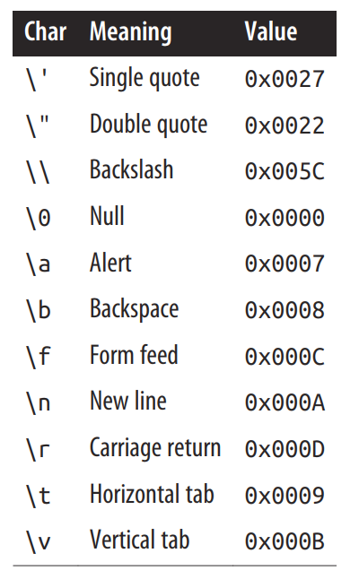

# string

## char

- System.Char
- 一个Unicode字符
- 占 2 字节
- Literal: ‘x’

### 转义字符

表示无法按字面意思表达的字符

`\u`（`\x`）可以使用4位16进制来表示字符

- char copyright = ‘\u00A9’;
- char omega = ‘\u03A9’;
- char newline = ‘\u000A’;

### char 的转换

- char类型可以隐式的转换到可以容纳无符号short类型的数值类型
- 对于其它的数值类型，需要显式的转换

## string

- System.String
- 表示一串**不可变**的Unicode字符
- Literal：“a string”
- 引用类型
- ==操作符比较string的值
- 适用于char的转义字符都适用于string

### 逐字字符串（verbatim string literal）

- @做前缀（在双引号外）：`@"里面的内容不转义"`
- 不支持转义字符
- 支持多行字符串
- 下面两字符串的值相同：
  - `string a1 = “\\\\server\\fileshare\\helloworld.cs”;`
  - `string a2 = @“\\server\fileshare\helloworld.cs”;`
- 想在字符串里面输入双引号，就输入两次双引号
  - `string xml = @”<customer id="“123”"></customer>”;`

### 字符串的连接

- `+`操作符
- 如果其中一个操作数不是string类型，那么会调用它的ToString方法
- 大量使用 + 做字符串连接的效率很低，最好使用StringBuilder
  - string是不可变的

### 字符串插值（string interpolation）

- C# 6
- $前缀（双引号外）
- 可包含表达式（在{}内）
  - `int x = 4; Console.WriteLine($“A square has {x} sides”);`
- 任何C#表达式都可以出现在{}内，会调用ToString或等效方法
- 可以改变表达式的显示格式，使用 : ，后边跟着格式化字符串
  - `string s = $”255 in hex is {byte.MaxValue:X2}”;`
- 默认只支持单行，除非使用@，$需在@前
- 想输入{，就需要输入{{

### string 的比较

- String不支持 > , < 等比较操作符
- 需要使用 CompareTo 方法

